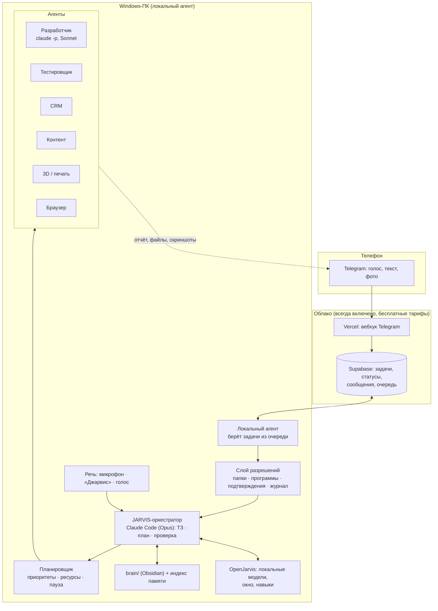

# JARVIS — план реализации по ТЗ (версия 2)

Персональный автономный ИИ-управляющий: принимает длинные голосовые задания, превращает их
в ТЗ и план, управляет Windows-ПК, ведёт разработку через Claude Code, координирует агентов,
проверяет результат и отчитывается в Telegram. Живёт в **одной папке** вместе со «вторым мозгом».

Связанные документы: [`AUDIT.md`](AUDIT.md) — что уже есть (этап 1); `README.md` — установка базы.

---

## 1. Решения, принятые после аудита

| Вопрос | Решение | Почему |
|---|---|---|
| На чём строить оркестратор | Свой код на Python в папке `core/`; OpenJarvis подключаем как библиотеку (память, каналы, навыки, окно) | ТЗ требует разрешений, планировщика ресурсов и облачного шлюза, которых в OpenJarvis нет; писать их внутри чужого репозитория — значит зависеть от его релизов |
| Как вызывать Claude Code | Раннер поверх `claude -p` (headless-режим CLI): JSON-вывод, `--resume` для сессий, `--allowedTools`, `--add-dir`, `--max-turns` | Работает по вашей подписке; это официальный программный интерфейс CLI, а не имитация кликов. Agent SDK требует API-ключ — оставляем как опцию |
| Облачная часть | Telegram-вебхук на **Vercel** + база задач в **Supabase** (оба уже подключены, бесплатные тарифы) | ПК выключен — задания всё равно принимаются и ждут в очереди; никаких новых подписок |
| Локальный агент | Python-служба Windows (автозапуск при входе), берёт задачи из Supabase, исполняет, отвечает в Telegram напрямую | один процесс, одна очередь, честный статус «ПК недоступен» |
| Второй мозг | папка `brain/` = **Obsidian-vault** (Markdown, wiki-ссылки) + индекс OpenJarvis для поиска | читаете и правите сами в Obsidian; Jarvis читает как контекст и ищет офлайн |
| Правила и вопросы | три уровня: `always.md` (дефолты, не спрашивать), `decided.md` (решённые вопросы — применять), `always-ask.md` (критичное — спрашивать всегда); вопросы копятся в `00-inbox/questions.md` | ваша идея «спросил один раз → стало правилом» реализуется файлами, без магии |
| Модели | Opus планирует и проверяет; Sonnet исполняет; Haiku — массовое и дешёвое; Ollama (qwen3.5) — офлайн и рутина | «дорогая голова, дешёвые руки» + контроль расходов |
| Речь | STT: faster-whisper (large-v3 при наличии GPU); TTS: Piper (бесплатно, офлайн) → при желании Silero или OpenAI TTS; активатор: openWakeWord, своя модель «Джарвис» | Kokoro русский не озвучивает; готовая `hey_jarvis` — некоммерческая лицензия |
| Первый тестовый проект | небольшой: «список дел» или мини-CRM на 3 сущности, а не полная CRM брата | сценарий этапа 3 проверяется за часы, а не недели |

---

## 2. Структура проекта (одна папка)

Отдельный репозиторий `jarvis` (не внутри сайта). Всё, что Jarvis знает и умеет, — файлы здесь.

```
jarvis/
├── CLAUDE.md                 конституция: кто я, роли, что можно без спроса, что нельзя, формат отчёта
├── README.md
├── brain/                    ВТОРОЙ МОЗГ — открывается в Obsidian как vault
│   ├── 00-inbox/             questions.md (вопросы Jarvis ко мне), голосовые заметки (расшифровки)
│   ├── 10-rules/             always.md · decided.md · always-ask.md
│   ├── 20-me/                кто я, бизнесы, стиль общения, расписание, контакты
│   ├── 30-projects/<имя>/    ТЗ.md · план.md · решения.md · статус.md · журнал.md
│   ├── 40-clients/  50-suppliers/  60-content/  70-3d-print/  75-crm/
│   ├── 80-howto/             как я делаю вещи (сырьё для навыков: «отчёт такой-то», «в 3ds Max так»)
│   ├── 90-lessons/           ошибки → правила
│   └── daily/                дневник: что Jarvis сделал за день
├── agents/                   субагенты Claude Code (Markdown с шапкой: name, model, tools)
│   ├── planner.md · developer.md · tester.md · crm.md · content.md · 3d.md · browser.md
├── skills/<имя>/             библиотека навыков: SKILL.md · tests/ · CHANGELOG.md
├── core/                     код Jarvis (Python 3.12, uv)
│   ├── gateway/              Telegram-вебхук (Vercel), очередь и статусы (Supabase), уведомления
│   ├── agent/                локальный Windows-агент: исполнитель задач, доступ к папкам/программам, скриншоты
│   ├── planner/              задачи, приоритеты, дедлайны, зависимости, ресурсы (CPU/GPU/принтер), расписание
│   ├── runners/              claude_code.py (claude -p, сессии, бюджет), ollama.py, shell.py
│   ├── speech/               stt.py (faster-whisper) · tts.py · wakeword.py
│   ├── integrations/         crm/ · instagram/ · metricool/ · max3ds/ · bambu/ · browser/
│   ├── policy/               разрешения, allow-list папок и программ, секреты, журнал действий
│   └── reporting/            единый формат отчёта, отправка файлов/скриншотов
├── config/                   settings.toml · allowlist.toml · .env.example
├── data/                     tasks.db (локальная копия), logs/, sessions/   (в .gitignore)
├── tests/                    unit + сценарные тесты («голосовое → отчёт»)
└── docs/                     ARCHITECTURE.md · AUDIT.md · DECISIONS/ (ADR) · демо этапов
```

Проекты, которые Jarvis разрабатывает (например, CRM брата), живут **вне** этой папки:
`D:\Projects\<имя>` — своя папка, свой Git, свой `CLAUDE.md`, ссылка на карточку в `brain/30-projects/`.

---

## 3. Архитектура



**Путь задания:** голосовое в Telegram → вебхук сохраняет файл и задачу в Supabase →
локальный агент (если ПК включён) скачивает, расшифровывает → оркестратор (Opus) пишет ТЗ и
план, кладёт в `brain/30-projects/<имя>/` → планировщик ставит этапы в очередь с учётом ресурсов →
разработчик (`claude -p` в папке проекта) → тестировщик (отдельный запуск + реальные тесты +
скриншот) → оркестратор сверяет с критериями готовности → отчёт в Telegram.
ПК выключен → шлюз отвечает «принял, ПК недоступен, в очереди» и ничего не обещает.

**Разрешения (§14 ТЗ):** `always-ask.md` + `allowlist.toml`. Без подтверждения — только обратимые
действия внутри разрешённых папок и программ. Подтверждение — кнопками в Telegram
(«Да / Нет / Подробнее»), таймаут = не делать. Секреты — Диспетчер учётных данных Windows,
`.env` вне Git. Каждый шаг — строка в `data/logs/actions.jsonl`.

**Проверка результата (§4, §16):** «агент сказал готово» не считается. Готово = тесты проходят +
тестировщик подтвердил критерии из ТЗ + артефакт (скриншот/файл) приложен к отчёту.

---

## 4. Второй мозг и самообучение

Механика вашей идеи «спросил → ответил → стало правилом»:

1. Jarvis не знает, как поступить → пишет вопрос в `brain/00-inbox/questions.md` и в Telegram.
2. Вы отвечаете (голосом или текстом). Ответ записывается в `10-rules/decided.md` с датой и контекстом.
3. Скажете «всегда так» → правило переезжает в `always.md`, больше не спрашивает.
4. Скажете «это важно, спрашивай каждый раз» → `always-ask.md`.
5. Ошибка → запись в `90-lessons/` → при следующем похожем деле Jarvis читает урок.
6. Раз в неделю — прогон тестовых сценариев; результаты и изменения правил — в `daily/`.

Obsidian: открываете папку `brain/` как vault. Жёстких плагинов не требуется; для удобства —
Dataview (таблицы проектов) и Templater (шаблоны карточек). Jarvis пишет обычный Markdown с
`[[wiki-ссылками]]`, Obsidian их подхватывает.

---

## 5. Агенты (роли по ТЗ §4)

| Агент | Модель | Инструменты (allow-list) | Что считается результатом |
|---|---|---|---|
| **Планировщик** | Opus | чтение `brain/`, планировщик задач | ТЗ + план с этапами, критериями готовности, оценкой времени |
| **Разработчик** | Sonnet (сложное — Opus) | `claude -p` в папке проекта, Git, тесты | коммиты + зелёные тесты + отчёт по этапу |
| **Тестировщик** | Sonnet | запуск тестов, скриншоты, чтение ТЗ | протокол: критерий → прошёл/нет → доказательство |
| **CRM** | Haiku/Sonnet | API вашей CRM (только чтение по умолчанию) | отчёты из реальных данных; изменения — с подтверждения |
| **Контент** | Sonnet | скиллы контента, Higgsfield, Metricool | план → утверждение → публикация → статистика |
| **3D / печать** | Sonnet + скрипты | 3ds Max MCP/MAXScript, проверка сетки, Bambu Studio CLI, MQTT принтера | STL/3MF + отчёт проверки + оценка времени печати; печать — с подтверждения |
| **Браузер** | Sonnet | Playwright по allow-list сайтов | данные/скриншоты; операции — согласованные |

Агенты студии Dreamhouses (Лид, Смета, Секретарь, Рендер, Ретушь, Презентатор, Снабженец,
Сисадмин) из первой версии плана становятся **навыками и подагентами** внутри этих ролей —
ничего не теряем.

---

## 6. Планировщик задач (§5)

Задача = `{id, title, priority, deadline, estimate, depends_on[], resources[], state, progress, project}`.
Ресурсы: `cpu`, `gpu`, `printer:bambu-1`, `claude-budget`, `network`. Правила:

- параллельно — всё, что не делит ресурс и не зависит друг от друга;
- рендер занимает `gpu` → 3D-моделирование ждёт или идёт на CPU;
- `printer` — один; следующий заказ готовится (модель, нарезка), но печать ждёт очереди;
- новая срочная задача → пересчёт; менее важная ставится на паузу с сохранением состояния
  (сессия Claude Code, черновики, статус в `brain/`), возобновляется позже;
- ошибка → перенос с причиной; три ошибки подряд → вопрос к вам;
- срок под угрозой → предупреждение заранее, причина, новый план;
- всё в Supabase + локальная копия; после перезагрузки ПК агент продолжает с последнего состояния.

---

## 7. Речь (§1)

- **С ПК:** активатор «Джарвис» (openWakeWord, своя модель) → запись до паузы ≥ 1,5 с (не перебивает) →
  faster-whisper → текст. Ответ голосом (Piper, русский) + текст в окне.
- **Из Telegram:** голосовое любой длины → скачать → ffmpeg → faster-whisper (по частям) → текст.
- **Длинный рассказ → ТЗ:** оркестратор извлекает цели, обязательные/дополнительные функции,
  ограничения, сроки; неясное — в вопросы (не более 3–5 за раз).
- **Дополнения к текущей задаче:** сообщение с упоминанием проекта или ответ на отчёт → приклеивается к задаче.
- **Звонки:** этап 7. Исследуем клиентский API Telegram (второй аккаунт «Jarvis», MTProto, NTgCalls).
  Если ненадёжно — голосовые сообщения + push. Обычный телефонный звонок (Twilio) — платно, только с вашего согласия.

---

## 8. Расходы и подписка (§12)

- Подписка Claude (Pro/Max) покрывает `claude -p` и планирование. Лимиты — по окнам времени;
  раннер читает лимиты из ответов CLI, при исчерпании ставит задачи на паузу и сообщает вам.
- Учёт: каждый запуск `claude -p` возвращает `total_cost_usd` (эквивалент API) и токены →
  пишем в `data/logs/costs.jsonl`, дневной/недельный отчёт. Порог на день — в `config/settings.toml`.
- Ничего платного (API-ключи, Twilio, облачный STT, VPS) не включается без подтверждения.
- Экономия: локальная модель для сортировки и черновиков, кэш контекста проекта в `brain/`,
  повторное исследование одного проекта запрещено правилом.

---

## 9. Этапы, сроки и критерии приёмки

Оценка при работе 2–4 часа в день с вашей стороны на тесты и ответы. Разработку веду я
(Claude Code); вы запускаете и проверяете на своём ПК.

| Этап | Что делаем | Критерий приёмки (проверяем вживую) | Срок |
|---|---|---|---|
| **1. Аудит** | `AUDIT.md` | документ есть | ✅ сегодня |
| **2. Тех-план** | репозиторий `jarvis`, `CLAUDE.md`, `docs/ARCHITECTURE.md`, каркас папок, `brain/` с правилами, `.env.example`, бэкап/откат через Git | `git clone` → структура на месте → Obsidian открывает `brain/` | 1–2 дня |
| **3. Первый сценарий** | шлюз (Vercel+Supabase), локальный агент, STT, оркестратор-ТЗ, раннер `claude -p`, тестировщик, отчёт | голосовое «сделай список дел с тегами» → ТЗ и план в `brain/` → папка проекта → код → тесты зелёные → отчёт со скриншотом в Telegram | 2 недели |
| **4. Планировщик** | очередь, приоритеты, дедлайны, ресурсы, пауза/возобновление, восстановление после перезапуска | три задачи одновременно (рендер-заглушка на GPU, разработка, контент): порядок верный, перезагрузка не теряет прогресс, срыв срока предупреждён заранее | 1–2 недели |
| **5. Управление ПК** | слой разрешений, allow-list папок/программ, запуск VS Code/3ds Max, скриншоты, Git, терминал, автозапуск агента | «открой проект X в VS Code и пришли скриншот» работает; попытка выйти за разрешённую папку — отказ + журнал | 1–2 недели |
| **6. Интеграции** | по очереди: CRM (чтение → отчёты → операции с подтверждения) · мониторинг Instagram-бота · контент-завод через Metricool · 3ds Max · Bambu (нарезка, статус, печать с подтверждения) | утренний отчёт по CRM из реальных данных; Instagram-бот: обнаружение сбоя и уведомление; заказ на печать: STL + проверка + 3MF + время печати → подтверждение | 4–8 недель, зависит от API |
| **7. Расширение** | библиотека навыков с тестами, обучение новым навыкам из разговора, активатор «Джарвис», русский голос, исследование звонков | «Джарвис, научись делать отчёт X» → навык сохранён, протестирован, применён; голосовой диалог с ПК | 3–4 недели |

**Итого:** рабочий Jarvis (этапы 1–5, голосовое задание → готовый проверенный проект → отчёт)
— **6–8 недель**. Полное ТЗ (этапы 1–7) — **3–4 месяца** при стабильном темпе. Дальше система
растёт сама через правила и уроки; «через год максимально эффективный» — реалистично именно
за счёт накопленных `brain/10-rules` и `skills/`, а не новых больших разработок.

Что удлиняет сроки: отсутствие API у CRM или Instagram-бота (тогда пишем адаптеры), слабый ПК
(нативная сборка, whisper без GPU), задержки с ответами на вопросы.

---

## 10. Что делаем следующим шагом (переход в VS Code)

1. Отвечаете на вопросы из раздела 11 (хотя бы 1–4).
2. На ПК: устанавливаете Claude Code и VS Code, открываете пустую папку `D:\jarvis`, запускаете
   в ней Claude Code. Первое сообщение там: *«Продолжаем проект JARVIS по PLAN.md и AUDIT.md
   из репозитория dream-houses/jarvis, этап 2»* — и я собираю каркас на вашем компьютере.
3. Параллельно (если ещё не сделано) — `Установить-Jarvis.bat`: база OpenJarvis нужна к этапу 3.

Если вместо VS Code вы имели в виду другой редактор — скажите, план от этого не меняется.

---

## 11. Вопросы, без которых этапы 3 и 6 не спланировать точно

1. **CRM.** Какая у вас CRM (название/ссылка)? Есть ли API или доступ к базе? Кто её делал?
2. **Instagram-бот.** На какой платформе (ManyChat, SaleBot, свой код, другое)? Какой ИИ-сервис он использует и где заканчиваются лимиты?
3. **Telegram-боты.** Какие уже есть, на чём написаны, есть ли доступ к коду и токенам?
4. **3D-печать.** Модель принтера (Bambu Lab X1C / P1S / A1 …), подключён ли к сети, используете ли Bambu Cloud или LAN-режим.
5. **ПК.** Процессор, видеокарта (объём памяти), ОЗУ, диск; версия 3ds Max; стоит ли уже VS Code и Git.
6. **Подписка Claude.** Pro или Max (5× / 20×)? Есть ли API-ключ (если нет — не нужен, работаем по подписке).
7. **Шлюз.** Согласны ли на Vercel + Supabase (бесплатно, уже подключены) для приёма заданий при выключенном ПК? Альтернатива — VPS ≈ 5 $/мес.
8. **Звонки.** Готовы ли завести второй Telegram-аккаунт «Jarvis» (нужна SIM) для исследования звонков на этапе 7?
9. **Команда.** Кто, кроме вас, будет давать Jarvis задания или получать отчёты (сотрудники, брат)?
