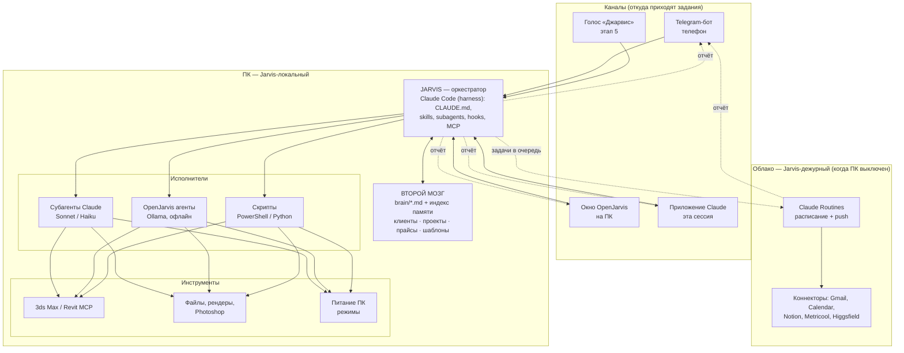
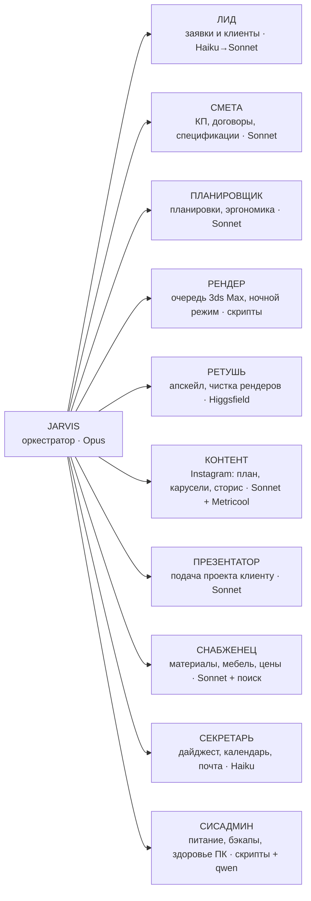

# Jarvis для Dreamhouses TJ — архитектура и план

Личный ИИ-ассистент дизайнера интерьера: живёт на вашем компьютере, получает задания
с телефона и из окна на ПК, работает онлайн и офлайн, сам управляет питанием компьютера,
держит «второй мозг» студии и раздаёт работу агентам-специалистам.

Документ живой: правим по мере ответов на вопросы (раздел 12) и по ходу этапов (раздел 11).

---

## 1. Что я уже знаю о вашей работе

Собрано из репозитория сайта, подключённых сервисов и нашего разговора.

| Факт | Откуда |
|---|---|
| Студия дизайна интерьера **Dreamhouses TJ**, Душанбе. Вы дизайнер, есть инженеры | разговор |
| Услуги: дизайн-проект квартиры (от 3 000 сомони), дом (от 8 000), коммерческие объекты, 3D-визуализация, авторский надзор, консультация (от 500/комната) | `index.html` |
| Процесс: консультация → дизайн-проект → 3D-визуализация → реализация | `index.html` |
| Заявки с сайта уходят **ссылками в WhatsApp / Telegram** (`wa.me/992909808180`, `t.me/dreamhouses_tj`); сервера нет, база клиентов не ведётся автоматически | `index.html` |
| Instagram **@dream_houses.tj** + страница Facebook подключены в **Metricool** (бренд «Dream Houses.tj», часовой пояс Asia/Dushanbe) | Metricool |
| Подключены: Gmail, Google Calendar, Google Drive, Notion, Figma, Higgsfield (генерация картинок/видео, апскейл), Metricool, Supabase, Vercel, Windsor.ai. Canva ждёт авторизации | коннекторы сессии |
| Установлены скиллы под вашу работу: планировщик квартир, 3ds Max MCP, Revit MCP, презентации, сторис/карусели/Reels, улучшение фото, инфографика, КП, брендбук | скиллы сессии |
| В Notion и Google Drive ничего про Jarvis/агентов нет — прошлая схема агентов лежит где-то ещё | поиск |

Это даёт картину: продажи идут через мессенджеры и Instagram, продукт — дизайн-проект с 3D,
рутина — переписка, КП, рендеры, контент. Именно туда и направлены агенты ниже.

---

## 2. Принципы

1. **Дорогая голова, дешёвые руки.** Планирует и проверяет сильная модель (Claude Opus),
   исполняет средняя (Sonnet) или дешёвая (Haiku), рутину и офлайн — локальная модель
   через Ollama. Так и дешевле, и надёжнее: у каждой задачи свой уровень.
2. **Локально по умолчанию.** Данные клиентов, проекты, рендеры не покидают ПК.
   В облако уходит только то, что нужно сильной модели, и только с вашего ведома.
3. **Всё — файлы в Git.** Каждый агент, правило, шаблон и заметка «второго мозга» — текстовый
   файл в репозитории `jarvis-brain`. Это и есть «путь вайб-кодера»: Jarvis сам правит свои
   файлы, а история изменений видна.
4. **Один формат отчёта.** Любой агент заканчивает работу одинаково: *сделано / нужно ваше
   решение / следующий шаг / файлы*. Отчёт уходит туда, где вы сейчас: телефон или экран.
5. **Опасное — только с подтверждения.** Удаление, оплата, отправка сообщений клиентам,
   выключение ПК во время рендера — Jarvis спрашивает. Всё остальное делает сам.
6. **Harness сильнее модели.** Правила (`CLAUDE.md`), хуки, allow-list инструментов,
   журнал и еженедельный разбор ошибок дают больше надёжности, чем любая «умная» модель.

---

## 3. Архитектура



Два Jarvis-а, одна память:

| | Jarvis-локальный (ПК) | Jarvis-дежурный (облако) |
|---|---|---|
| Где | ваш компьютер | Claude Code в облаке (эта сессия) + Routines |
| Когда работает | ПК включён | всегда |
| Что умеет | всё: файлы, 3ds Max, рендер, питание, локальные модели | только облачные сервисы: почта, календарь, Notion, Instagram-аналитика, поиск |
| Если ПК выключен | — | отвечает вам, делает облачное, а задачи для ПК кладёт в очередь (`inbox/`), ПК забирает их при включении |

---

## 4. Модели и маршрутизация

| Роль | Модель | Где | Зачем |
|---|---|---|---|
| Планировщик, ревьюер, сложные решения | **Claude Opus 5** (для самых сложных — Fable 5.1) | Claude Code на ПК, по вашей подписке | разбирает задание на шаги, проверяет результат исполнителей |
| Исполнитель | **Claude Sonnet 5** | субагенты Claude Code | пишет КП, тексты, скрипты, разбирает планировки |
| Массовые дешёвые задачи | **Claude Haiku 4.5** | субагенты | классификация заявок, короткие ответы, разбор почты |
| Офлайн, приватное, круглосуточное | **qwen3.5 4b / 9b** через Ollama | OpenJarvis | поиск по «второму мозгу», черновики, дежурство ночью |
| Распознавание речи | faster-whisper (русский понимает) | локально | голос → текст |
| Голос ответа (русский) | облачный TTS (OpenAI/Cartesia) или локальный русский (Silero/Piper) | этап 5 | встроенный Kokoro русский не озвучивает |

Как задаётся: у каждого субагента Claude Code в шапке файла `model: opus|sonnet|haiku`;
у агентов OpenJarvis — политика роутера в `config.toml`. Правило по умолчанию:
**Opus только планирует и проверяет, руками не работает.**

Стоимость: планирование через Claude Code идёт по подписке. Автономные запуски (по
расписанию, из Telegram) тоже можно гонять через Claude Code в фоновом режиме
(`claude -p`) по подписке; API-ключ понадобится, только если захотим отдельный лимит.
Локальные модели бесплатны.

---

## 5. Второй мозг

Папка `brain/` в репозитории `jarvis-brain` на ПК. Markdown, читается человеком и машиной.

```
brain/
├── studio.md          # кто мы, услуги, цены, процесс, стиль общения с клиентом
├── brand-voice.md     # как пишем в Instagram: тон, запретные слова, хэштеги, примеры
├── clients/           # одна папка на клиента: карточка, переписка (кратко), решения, файлы
│   └── 2026-09-ivanov-kvartira-3k/
├── projects/          # стадии, дедлайны, кто отвечает, что ждём от клиента
├── suppliers.md       # поставщики Душанбе и зарубежные: контакты, сроки, условия
├── prices.md          # прайс на услуги + типовые сметы по материалам
├── templates/         # КП, договор, ТЗ, спецификация, чек-листы этапов, ответы на частые вопросы
├── lessons.md         # что пошло не так и как теперь делаем (Jarvis дописывает сам)
└── inbox/             # очередь задач от Jarvis-дежурного для ПК
```

Как работает:
- Claude Code читает `brain/` как контекст (через `CLAUDE.md`), OpenJarvis индексирует его
  (`jarvis memory index brain/`) — поиск работает и офлайн.
- После каждого дела Jarvis дописывает заметку: новый клиент → карточка; решение по проекту →
  строка в проекте; ошибка → `lessons.md`.
- Notion (уже подключён) — зеркало CRM для команды, если инженерам нужен доступ без Git.
  Источник истины всё равно `brain/`.

---

## 6. Агенты

Каждый агент — папка `agents/<имя>/` с файлом `SKILL.md` (роль, правила, инструменты,
формат отчёта). Один и тот же файл понимают и Claude Code, и OpenJarvis (стандарт agentskills.io).



| Агент | Что делает | Триггер | Инструменты | Что вам приходит |
|---|---|---|---|---|
| **Jarvis** | принимает задание, уточняет, делит на шаги, раздаёт агентам, проверяет, собирает отчёт | любое сообщение | все агенты, `brain/` | один отчёт по задаче |
| **Лид** | из пересланного сообщения клиента делает карточку, определяет тип объекта и бюджет, готовит ответ по шаблону, предлагает время консультации, ставит напоминание | вы пересылаете сообщение из WhatsApp/Instagram в Telegram-бот | `brain/clients`, шаблоны, Calendar | черновик ответа «отправить? да/нет» + карточка |
| **Смета** | КП по прайсу и площади, договор по шаблону, спецификация материалов в Excel | «сделай КП для Иванова, 3-комн., 84 м²» | xlsx/docx/pdf, `prices.md` | готовые файлы |
| **Планировщик** | разбирает план квартиры: зоны, проходы, эргономика, варианты расстановки | фото/PDF плана | скилл apartment-planner | разбор + схема |
| **Рендер** | ставит сцены в очередь, запускает рендер ночью, следит за прогрессом, по окончании — превью и выключение ПК | «рендер ночью», расписание | 3ds Max MCP, PowerShell | превью в Telegram, «ПК выключен в 03:40» |
| **Ретушь** | апскейл до 4K, шум, свет, фон, подготовка под печать и Instagram | папка с рендерами | Higgsfield, photo-enhancer | обработанные файлы |
| **Контент** | контент-план на неделю, тексты каруселей и сторис, сценарии Reels, подписи, публикация через Metricool, отчёт по охватам | понедельник 10:00 или запрос | скиллы контента, Metricool, Higgsfield | план на согласование, потом «опубликовано» |
| **Презентатор** | презентация дизайн-проекта клиенту из рендеров и текстов | «презентацию для Иванова» | presentation-pro, pptx/pdf | PPTX/PDF |
| **Снабженец** | ищет мебель/материалы под ТЗ, сравнивает цены и сроки, ведёт `suppliers.md` | «найди плитку под этот рендер» | поиск, Drive | таблица вариантов |
| **Секретарь** | утренний дайджест: календарь, почта, новые заявки, дедлайны проектов, погода | 08:00 ежедневно | Gmail, Calendar, `brain/projects` | сообщение в Telegram |
| **Сисадмин** | режимы питания, бэкап `brain/` и проектов, обновления, место на диске, температура GPU | расписание + команды | PowerShell, Task Scheduler | только если что-то не так |

Первые в работу (по деньгам и времени): **Лид, Секретарь, Смета**, затем **Рендер**.

---

## 7. Каналы связи и отчёты

**Telegram-бот** (основной, с телефона). Отвечает только вашему аккаунту.

| Команда | Что делает |
|---|---|
| просто текст или голосовое | новое задание Jarvis'у |
| пересланное сообщение клиента | запускает агента Лид |
| фото плана / рендера | Планировщик или Ретушь, спросит что нужно |
| `/статус` | что сейчас делает ПК, очередь задач, рендер % |
| `/отчёт` | отчёт за сегодня |
| `/режим работа|рендер|ночь|дежурство|выкл` | переключить режим питания (раздел 8) |
| `/выключи`, `/сон`, `/проснись` | питание вручную |
| `/экран` | скриншот экрана ПК |

**Окно OpenJarvis на ПК** — тот же Jarvis, когда вы за компьютером. Чат, история, память.

**Приложение Claude** (эта сессия) — Jarvis-дежурный: работает, когда ПК выключен;
push-уведомления по расписанию; отсюда же я меняю файлы Jarvis'а.

**Формат отчёта** (всегда один):
```
✅ Сделано: ...
❓ Нужно решить: ... (или «ничего»)
➡️ Следующий шаг: ...
📎 Файлы: ...
```

---

## 8. Режимы питания (5 режимов)

| Режим | Что происходит | Когда |
|---|---|---|
| **Работа** | обычная работа, сон выключен, Jarvis в трее | вы за ПК |
| **Рендер** | производительность максимум, сон запрещён, экран гаснет, GPU/CPU под рендер; Telegram получает прогресс | рендер днём |
| **Ночь** | выполнить очередь (рендеры, апскейл, бэкап, индексация памяти), прислать отчёт и **выключить ПК** | вечером командой или по расписанию 23:00 |
| **Дежурство** | ПК спит, но просыпается по таймеру: 07:30 — дайджест и очередь из облака, потом снова спать. Разбудить можно с телефона из домашней сети | когда вас нет, но задания могут прийти |
| **Выкл** | полное выключение | выходные, отъезд |

Как сделано (Windows, без сторонних программ): схемы электропитания `powercfg`, задачи
Планировщика с флагом «разбудить компьютер», `shutdown /s`, сон через `powrprof`,
Wake-on-LAN на сетевой карте.

Честно про удалённое включение: **выключенный** ПК из другого города включить нельзя без
помощника в квартире. Варианты (выберем один):
1. **Не выключать, а «Дежурство»** — спит, просыпается сам по таймеру и по сигналу из домашней сети. Самый простой путь.
2. **Умная розетка** (Wi‑Fi, ~$10–15) + в BIOS «включаться при подаче питания» — включение из любого места через приложение розетки или команду бота.
3. **Роутер с доступом извне** или **старый Android-телефон** дома как «дежурный», который шлёт Wake-on-LAN по команде из Telegram.

---

## 9. Офлайн и онлайн

| Без интернета работает | Нужен интернет |
|---|---|
| чат с Jarvis на локальной модели | Claude (планирование сложных задач) |
| поиск по «второму мозгу», карточки клиентов, шаблоны | Instagram, Metricool, почта, календарь |
| 3ds Max, рендер, очередь, режимы питания | Higgsfield (апскейл, генерация) |
| распознавание голоса, локальный голос ответа | поиск поставщиков в сети |
| отчёты складываются в очередь и уходят в Telegram, когда сеть появится | Telegram (сам бот) |

Правило: если сети нет, Jarvis не молчит — делает локально, что может, и говорит, что отложил.

---

## 10. Надёжность и безопасность

- `CLAUDE.md` — конституция Jarvis'а: кто вы, что можно без спроса, что нельзя, формат отчёта.
- **Хуки** Claude Code: перед опасной командой (удаление, `shutdown`, отправка клиенту) —
  подтверждение в Telegram; после каждого действия — строка в журнал `logs/`.
- **Allow-list** инструментов у каждого агента: Лид не имеет доступа к рендерам, Рендер — к почте.
- **Ревью**: Opus проверяет результат исполнителя перед отправкой вам (КП посчитано верно? текст в тоне бренда?).
- **Еженедельный разбор**: 10–15 типовых задач студии как тест; прогон в воскресенье; что упало —
  в `lessons.md`, правила правятся. Это и есть «самообучение» без магии.
- **Ключи** (Telegram, API) — в Диспетчере учётных данных Windows и `.env`, никогда в Git.
- Telegram-бот отвечает только вашему chat_id; чужие сообщения игнорирует и логирует.
- Бэкап `brain/` и проектов — ежедневно в режиме «Ночь» на внешний диск/Drive.

---

## 11. Дорожная карта

Каждый этап заканчивается проверкой «с телефона → сделано → отчёт». Я готовлю файлы и
скрипты в репозитории; от вас — запустить установщик и ответить на вопросы. Если откроете
проект в Claude Desktop или запустите `claude remote-control` на ПК — делаю всё сам.

| Этап | Что появится | Проверка готовности | Срок |
|---|---|---|---|
| **0. База** ✅ | OpenJarvis установлен, ярлык, автозапуск | окно открывается, чат отвечает | сделано |
| **1. Фундамент** | Claude Code на ПК; репозиторий `jarvis-brain` с `CLAUDE.md`, `brain/`, `agents/`; Telegram-бот (задания, отчёты, `/статус`, `/режим`); 5 режимов питания; утренний дайджест | с телефона «переименуй файлы в папке X по шаблону» → сделано → отчёт в Telegram; ПК ушёл в «Ночь» и выключился сам | 1-я неделя |
| **2. Деньги** | агенты Лид, Секретарь, Смета; шаблоны КП/договора; карточки клиентов | пересланное сообщение клиента → карточка + черновик ответа + КП за 3 минуты | 2-я неделя |
| **3. Ночной конвейер** | Рендер (очередь 3ds Max, прогресс, превью, автовыключение) + Ретушь | вечером «рендер ночью» → утром превью 4K в Telegram, ПК выключен | 3–4-я неделя |
| **4. Контент и подача** | Контент (план на неделю, карусели, сторис, публикация через Metricool, отчёт по охватам) + Презентатор | понедельник: план на согласование; «презентацию Иванову» → PPTX | 5–6-я неделя |
| **5. Голос и снабжение** | слово-активатор «Джарвис» (openWakeWord), русский голос ответа, Снабженец | «Джарвис, что у меня сегодня?» → отвечает голосом | 7–8-я неделя |
| **6. Самопроверка** | набор тестов студии, еженедельный прогон, дашборд задач/расходов, Jarvis-дежурный в облаке с очередью | воскресный отчёт «что улучшил за неделю» | далее постоянно |

Этап 1 начинаю сразу после ваших ответов (раздел 12): большая часть файлов не зависит от них.

---

## 12. Вопросы к вам

Ответьте как удобно, хоть голосом. Без ответов на 1, 5 и 6 этап 1 не собрать целиком.

1. **Телефон.** Telegram как основной канал подходит? (WhatsApp Business API платный и сложный; Telegram-бот бесплатный и делается за час.)
2. **Программы.** В чём работаете: 3ds Max (Corona / V-Ray?), Revit, ArchiCAD, AutoCAD, SketchUp, Photoshop? Версии.
3. **Заявки.** Откуда приходят чаще: WhatsApp, Instagram Direct, звонки, сайт? Где сейчас записываете клиентов (блокнот, Excel, Notion, нигде)?
4. **Команда.** Сколько человек, кто что делает (инженеры — чертежи? сметы?). Нужен ли им доступ к Jarvis или он только ваш?
5. **Компьютер.** Стационарный или ноутбук; процессор, видеокарта, память; кабель или Wi‑Fi; один ПК или несколько. Есть ли дома умная розетка, роутер с доступом извне или старый Android?
6. **Подписка Claude.** Какой план (Pro / Max)? Готовы ли при необходимости платить за API отдельно (ориентир 20–60 $/мес при активной работе агентов)?
7. **Прошлая схема агентов.** Где вы её делали — Dify, n8n, Make, что-то ещё? Пришлите скриншот или экспорт, перенесу имена и роли.
8. **Язык.** Клиенты пишут по-русски, по-таджикски или на обоих? Нужны ли ответы на таджикском?

---

## Приложение. Что уже лежит в репозитории

- `jarvis/Установить-Jarvis.bat`, `jarvis/install-jarvis.ps1` — установщик базы (этап 0).
- `jarvis/README.md` — как установить и пользоваться.
- `jarvis/PLAN.md` — этот документ.

Источники по компонентам: [OpenJarvis](https://github.com/open-jarvis/OpenJarvis) (агенты, память,
каналы Telegram, планировщик, скиллы), [openWakeWord «hey jarvis»](https://github.com/dscripka/openWakeWord/blob/main/docs/models/hey_jarvis.md)
(слово-активатор; готовая модель только для некоммерческого использования, для студии обучим свою —
[пример тренера под Windows](https://github.com/nibor1896/custom-wakeword-trainer)).
